# LinguaRise

## Temat  
**Aplikacja webowa do nauki języków obcych**, umożliwiająca interaktywną naukę poprzez rozmowy z chatbotem oraz analizę poprawności wymowy użytkownika.

## Opis projektu
System wspiera naukę języka poprzez różne metody, takie jak:  
- 🎧 Słuchanie i powtarzanie fraz  
- ✍️ Pisanie ze słuchu  
- 📝 Tłumaczenie słów
- 💬 Swobodna konwersacja z chatbotem dostosowaną do poziomu użytkownika

Postęp użytkownika jest na bieżąco zapisywany, dzięki czemu możliwe jest kontynuowanie nauki w dowolnym momencie.

---

## Członkowie zespołu i podział zadań  
### 👨‍💻 **Piotr Równicki**
- [x] Implementacja podstaw backendu  
- [x] Projektowanie i zarządzanie bazą danych
- [x] Autoryzacja i autentykacja użytkownika
- [x] Rozwój funkcjonalności słuchania i powtarzania fraz  
- [x] Implementacja ćwiczeń pisania ze słuchu

### 👨‍💻 Dawid Rudnicki  
- [x] Implementacja podstaw frontendu  
- [x] Integracja frontendu z backendem  
- [x] Rozwój funkcjonalności uzupełniania luk w zdaniach  
- [x] Nauka słownictwa poprzez obrazki

### 🤝 Zadania wspólne  
- [x] Realizacja funkcjonalności swobodnej konwersacji z chatbotem  
- [x] Implementacja mniejszych funkcji wspierających projekt
- [x] Interfejs użytkownika

---

## Architektura systemu  
📌 **Frontend**: Aplikacja ReactJS komunikująca się z backendem poprzez REST API  
📌 **Backend**: Aplikacja .NET Core zarządzająca logiką biznesową i bazą danych  
📌 **Baza danych**: Microsoft SQL Server do przechowywania danych użytkowników i postępów w nauce  
📌 **Usługi Azure**: Integracja z inteligentnymi usługami do analizy wymowy i interakcji z chatbotem  

---

## Usługi Azure  
☁️ **Azure Speech to Text** – analiza poprawności wymowy użytkownika  
☁️ **Azure Text to Speech** – generowanie odpowiedzi głosowych  
☁️ **Azure Bot Service** – chatbot do nauki języka  
☁️ **Microsoft Entra** – zarządzanie kontami użytkowników  

---

## Struktura bazy danych
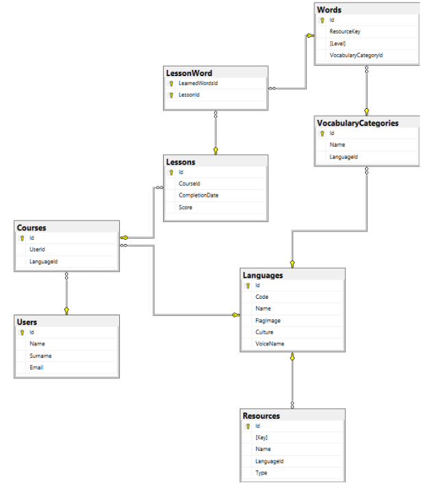

---

## Użyte technologie oraz biblioteki  
### Backend
- 🟣 .NET Core
- 🔵 Entity Framework
- 🔵 ASP.NET Web API 
- 🔵 Azure SDK

### Frontend
- 🟡 ReactJS

### Baza danych
- 🗄️ Microsoft SQL Server

---

## Interfejs użytkownika  

> Responsywny interfejs stworzony w **React** zapewnia łatwy dostęp do ćwiczeń, widoków postępu oraz ustawień konta.  
> Działa płynnie zarówno na komputerach, jak i urządzeniach mobilnych.

### 📑 Nawigacja

| Strona | Opis |
| ------ | ---- |
| **Strona główna** | Szybki dostęp do najnowszych lekcji |
| **Strona logowania** | Bezpieczne logowanie przy użyciu konta Microsoft |
| **Profil użytkownika** | Dane zalogowanej osoby |
| **Wybór języka kursu** | Lista dostępnych języków |
| **Wybór sposobu nauki** | Tryby nauki dopasowane do Twojego stylu |
| **Lekcja – słuchanie & powtarzanie** | Ćwiczenia wymowy z natywnymi nagraniami audio |
| **Lekcja – słuchanie & pisanie** | Dyktanda z natychmiastową weryfikacją odpowiedzi |
| **Lekcja – tłumaczenie słów** | Fiszki z inteligentnym powtórzeniem |
| **Lekcja – konwersacja z chatbotem** | Symulacja realnych dialogów |
| **Podsumowanie lekcji** | Wyniki i statystyki |
| **Strona o nas** | Opis funkcjonalności aplikacji |
| **FAQ** | Najczęściej zadawane pytania i odpowiedzi |

---

### 🖼️ Podgląd ekranów

<p align="center">
  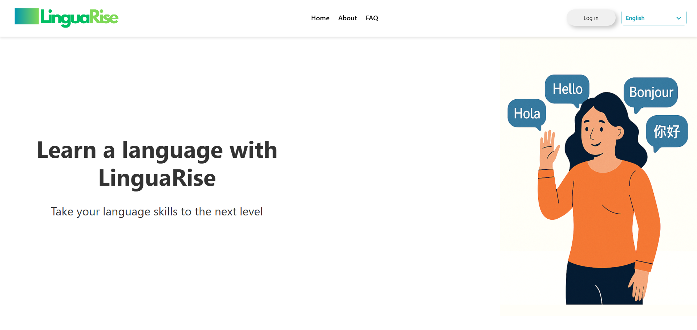
  <br/><br/>

  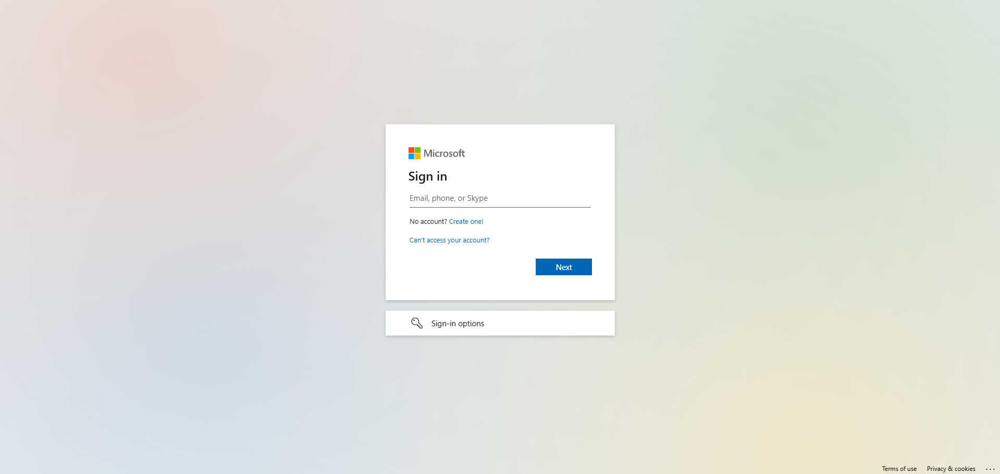
  <br/><br/>

  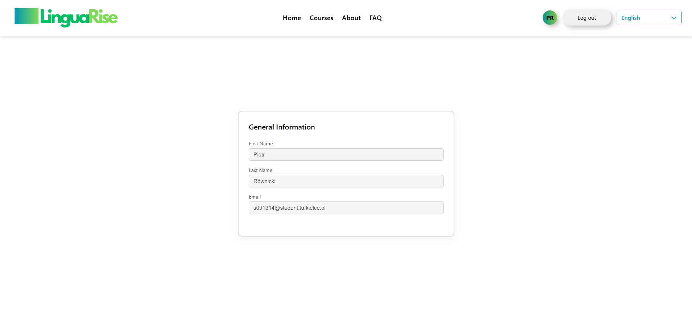
  <br/><br/>

  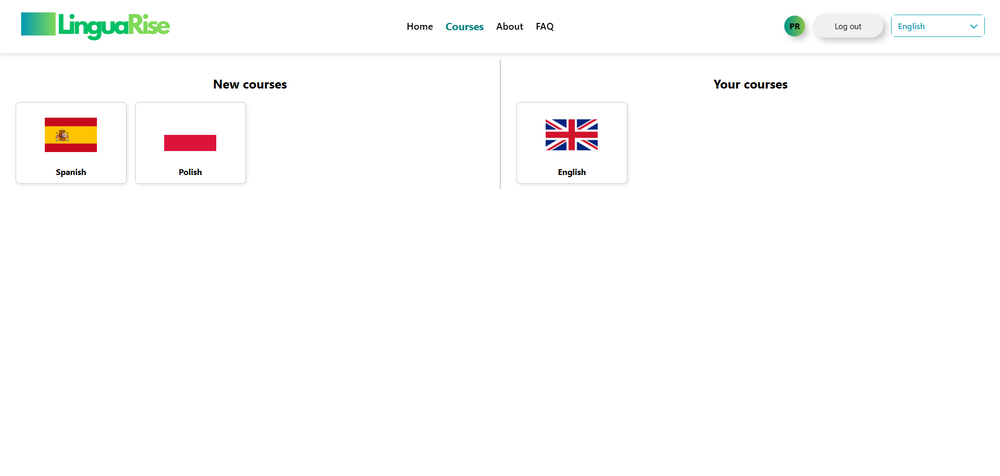
  <br/><br/>

  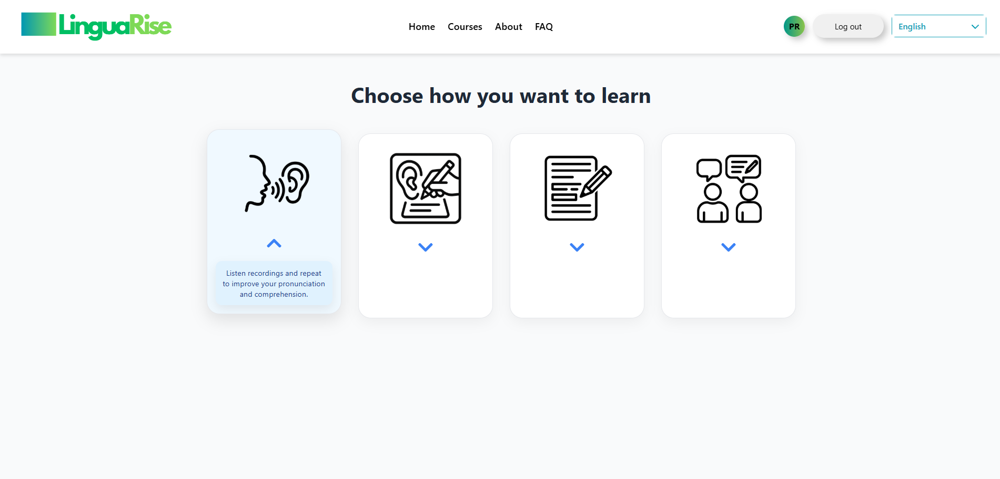
  <br/><br/>

  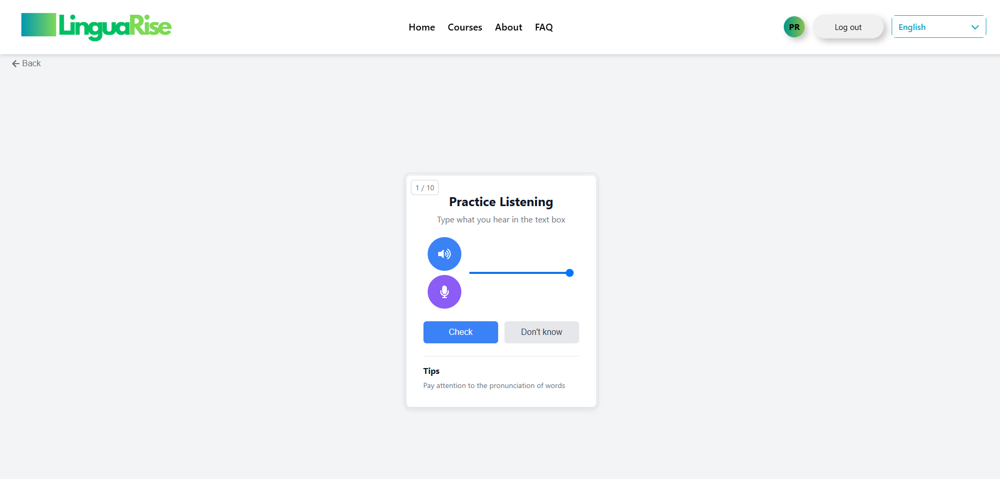
  <br/><br/>

  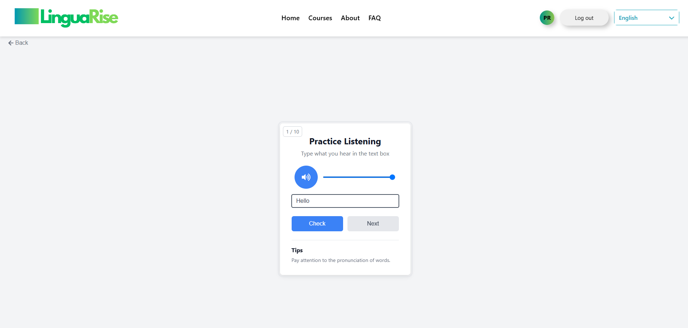
  <br/><br/>

  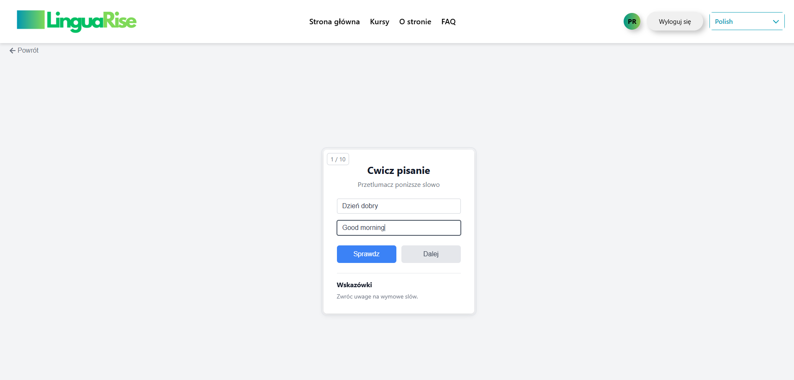
  <br/><br/>

  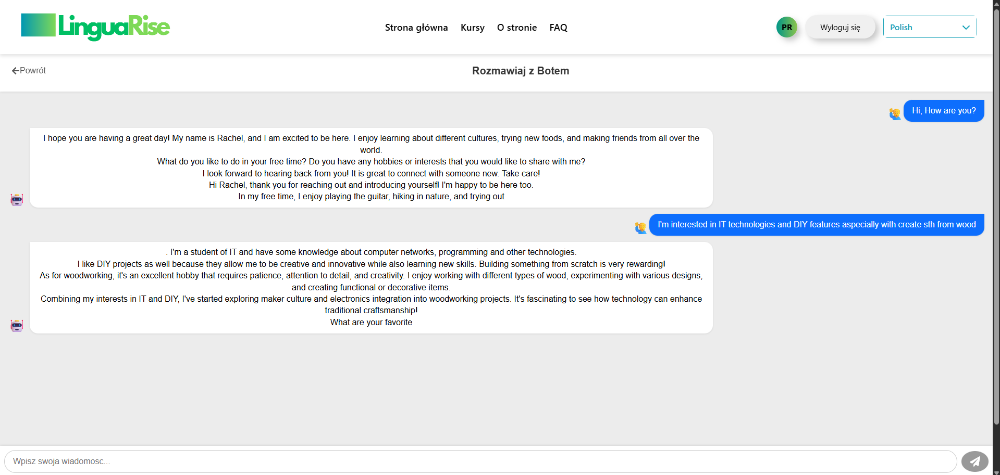
  <br/><br/>

  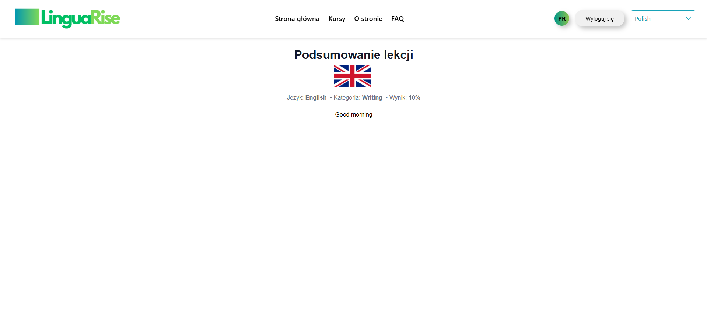
  <br/><br/>

  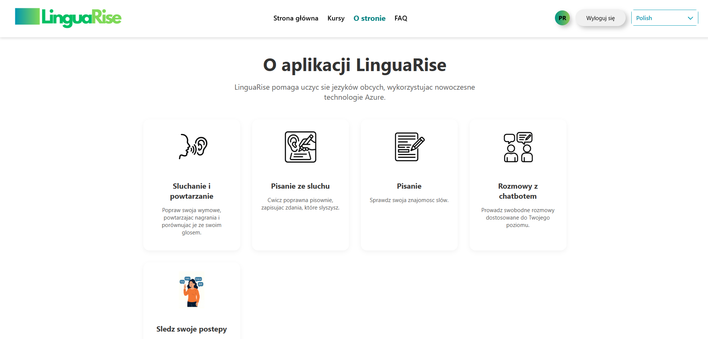
  <br/><br/>

  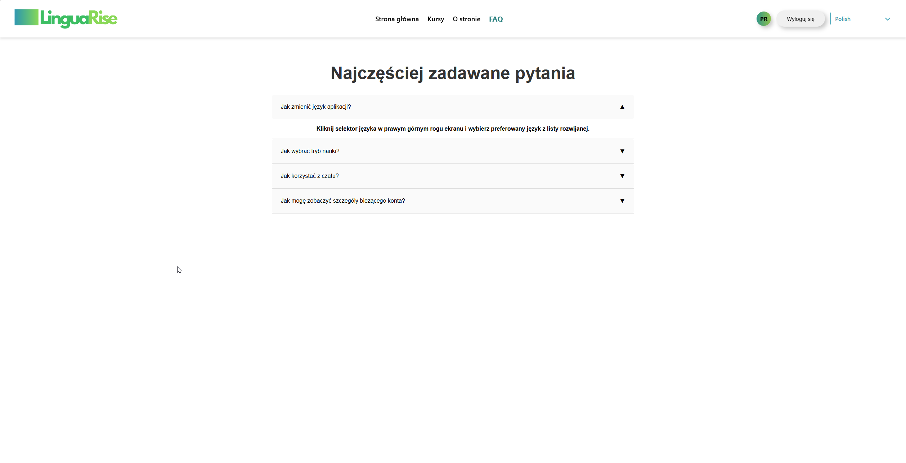
</p>


## Funkcjonalności  
✔️ Logowanie przez Microsoft Entra  
✔️ Interaktywna nauka języka poprzez różne metody  
✔️ Analiza wymowy użytkownika  
✔️ Personalizowane kursy i śledzenie postępów  
✔️ Integracja z chatbotem językowym  

---

## Instrukcja uruchomienia  

### Backend  
1. Zainstalować .NET SDK  
2. Skonfigurować Microsoft SQL Server  
3. Wykonać migracje bazy danych:
   a) Wyświetlić konsolę **`Package Manager Console`**
   b) Ustawić default project na **`LinguaRise.DataAccess`**
   c) Dodać migrację:  
      ```sh
      Add-Migration InitialCreate
      ```
   d) Utworzyć bazę i schemat:  
      ```sh
      Update-Database
      ```
   e) Zainicjować bazę danymi:
   - Pobrać plik **`script`** z katalogu **`Resources/`**
   - Otworzyć za pomocą Microsoft SQL Server Management Studio pobrany plik
   - Uruchomić skrypt zasilający bazę
5. Dodać do projektu plik ffmpeg.exe
   - Przejść do katalogu **`Resources/`**
   - Skopiować lub wypakować plik **`ffmpeg.exe`** do folderu projektu
     **`LinguaRise/LinguaRise.Api/`**
6. Dodać i skonfigurować chatbota dla projektu:
   a) Instalacja chatbota:
   - Przejść do katalogu **`Resources/`**
   - Uruchomić instalator **`gpt4all-installer-win64.exe`**
     
   > [!NOTE]
   > chatbota można zainstalować w dowolnym miejscu w systemie. Ważen by znajdował się on jedynie w pustym katalogu, gdyż dane które się w nim znajdują zostaną usunięte.

   b) Konfiguracja:
   - Uruchomić zainstalowany program **`GPT4All`**
   - Przejść do zakładki `Find Models`
   - Wybrać z listy model `LIama 3.2 3B Instruct`
   - Pobrać znaleziony model
   - Po zakończeniu pobierania wejść w ustawienia
   - Ustawić `Default Model` na ten który został pobrany
   - Zaznaczyć opcję `Enable Local API Server`
  
   > [!IMPORTANT]
   > Po wykonaniu konfiguracji, dla prawidłowego działania, należy wyłączyć i uruchomić ponownie aplikację **`GPT4All`**
   
8. Uruchomić backend:  
   ```sh
   dotnet run --project LinguaRise.Api
   ```
   
### Frontend
1. Zainstalować Node.js oraz npm
2. Pobrać zależności:
   ```sh
   npm install
   ```
3. Uruchomić frontend:
   ```sh
   npm start
   ```
